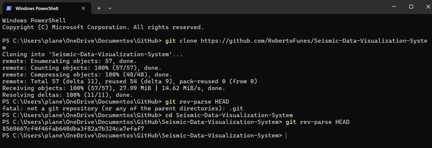
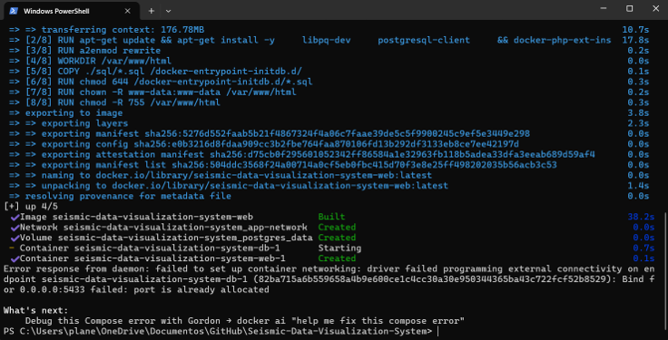
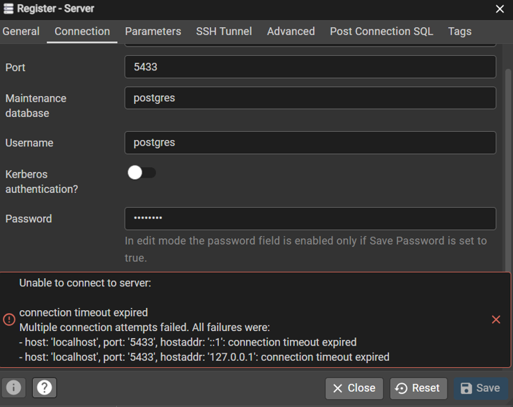
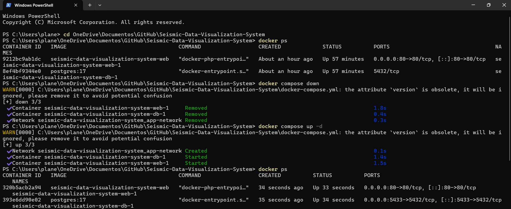
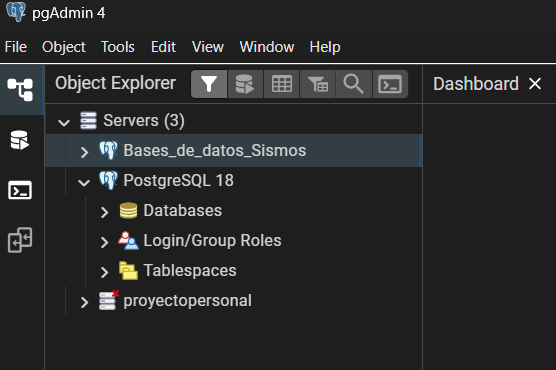
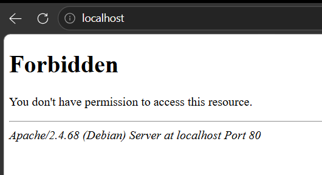
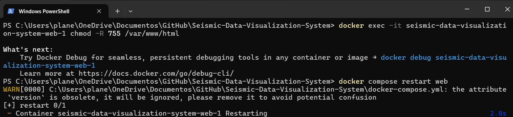
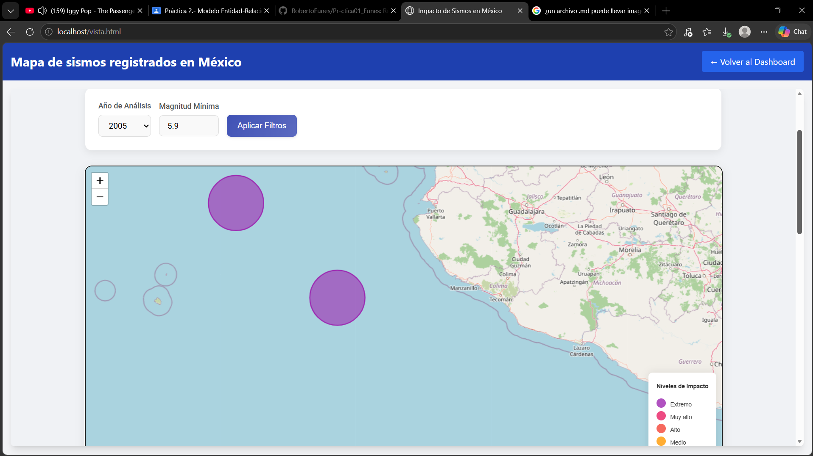
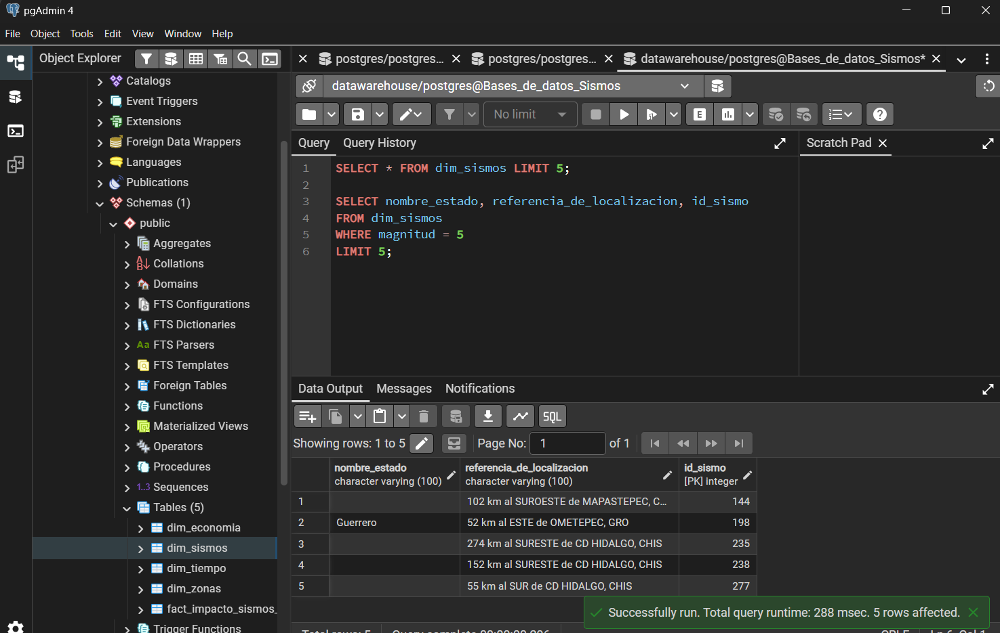

Proceso de puesta en funcionamiento de proyecto asignado:

1.-Seguimos el link al repositorio publicado por el profesor en GitHub, luego dimos click en "fork" y copiamos todo en un repositorio separado del que usamos para guardar todos los archivos de la práctica 2.

2.-Abrimos la terminal en la carpeta "Github" de uno de nuestros quipos y clonamos el repositorio con el comando que contiene el archivo README.

3.-Para levantar el contenedor, previamente abrimos Docker y luego ejecutamos el comando "Docker compose up -d" en la terminal.

4.-Al intentar conectarnos desde pgAdmin nos mostro un error por tiempo de expiración.

5.-Ejecutamos el comando "docker ps" para obtener información sobre los contenedores y ver que ocurría. Nos dimos cuenta de que el contenedor no había dejado expuestos los puertos para que nos pudiéramos conectar desde la computadora. 
Resolvimos este problema dando de baja el contenedor y volviendo a levantarlo.

6.-Finalmente pudimos conectarnos al servidor desde pgAdmin.

7.-Al buscar la página "http://localhost/" no encontró la página que mostraba un mensaje "no tienes permiso para acceder a este recurso". 

8.- Para confirmar que la carpeta del contenedor tuviera los permisos necesarios usamos el comando "docker exec -it seismic-data-visualization-system-web-1 chmod -R 755 /var/www/html." y lo reiniciamos con el comando "docker compose restart web".

9.-Nuevamente surgió un error porque en realidad no se trataba de un problema con permisos, sino que el servidor no encontró un archivo index.php o index.html (los que busca por defecto) dentro de la carpeta src/ del repositorio. Por lo que solo necesitamos entrar directamente a http://localhost/vista.html desde el buscador para poder entrar a la página e interactuar con la interfaz gráfica.

10.-La consulta que realizamos fue para conocer la ubicación de los cinco primeros sismos con una magnitud de cinco grados. realizamos la consulta directamente sobre la base de datos con código SQL:

